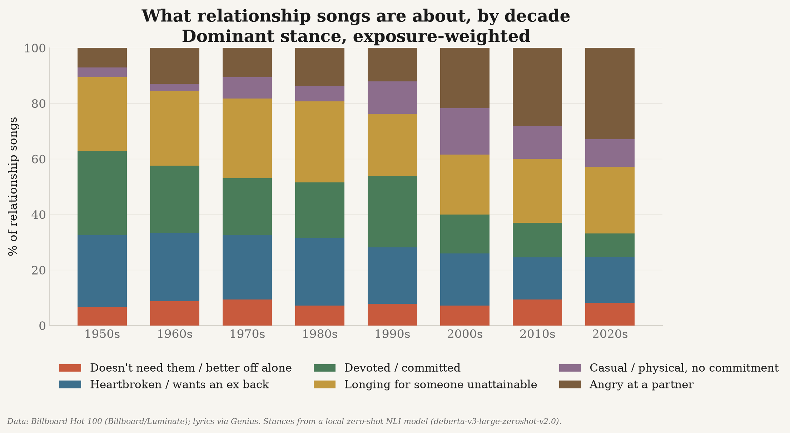

# music-tastes

**Are US hit songs getting sadder? Are fewer of them about love — and among the ones
that are, are more about *not needing* the relationship?**

A reproducible study of every song that entered the Billboard Hot 100 between
4 August 1958 and the present: **354,687 chart positions, 32,602 unique songs**.
Everything runs locally; the only network calls fetch chart data, lyrics and public
lexicons. There is no paid API anywhere in the pipeline.

---

## The short answer

**What songs are *about* changed more than how they *feel*.**

| Question | Answer | Confidence |
|---|---|---|
| Are fewer hits about love? | **No.** Flat at 65–77% across eight decades. | Good |
| Among love songs, more "I don't need you"? | **Yes** — roughly 3% to 18%. | **Strongest finding** |
| Are the lyrics getting sadder? | **Modestly** — ~0.08–0.10 SD per decade. | Moderate |
| Is the *music* getting sadder? | **No usable evidence.** | Weak |
| Are songs getting faster or slower? | **No change.** | Good |

---

## Fewer love songs? No.

The exposure-weighted share of hits about a romantic relationship has barely moved in
seven decades. The 2020s sit *above* the 1960s.


An unweighted version of this series *does* decline — but it fails the coverage check
(see below), so it is not reported as a finding.

---

## But the stance inside them shifted

Among relationship songs, the share taking an "I don't need you / I'm better off
alone" position rose roughly **five-fold**, concentrated after 2000.


This is the finding that survived every attempt to break it:

- **Coverage** — holds on a complete-case subset with equal songs per year
- **Genre** — genre fixed effects remove only ~5% of the effect
- **Not a rap artifact** — positive within pop, R&B and rock; flat in hip-hop
- **Era** — survives restriction to the post-1991 SoundScan window
- **Lyric length** — rises inside *every* length stratum
- **Wording** — replicates across 4 of 5 reworded hypotheses

**One caveat that matters.** The *absolute level* swings between roughly 1% and 15%
depending purely on how the hypothesis is phrased. Quote the trend, never the level.

The full stance mix shows what it grew alongside — conflict rose sharply too, while
devotion fell:



---

## Sadder? Only mildly, and only in the lyrics

This took two reversals to pin down, and it is the most interesting methodological
story in the project.


A word-norm lexicon shows a clear decline. A context-aware entailment model, run on
the *same songs*, shows nothing (p=0.94). That looks like the lexicon is an artifact —
until you notice both measures are length-biased **in opposite directions**
(lexicon ρ=−0.23, contextual ρ=+0.23), and lyrics roughly doubled in length. One bias
inflates the trend, the other masks it.

Opposite signs on the same nuisance variable cannot be a real effect; that is the
signature of measurement error, which is exactly when adjustment is warranted.
Adjusted, the two converge on **−0.10 and −0.085 SD per decade**, both significant.

Real, then — but considerably smaller than a naive word count implies.

---

## The music itself: no usable evidence

**Tempo is flat.** Hits are not getting faster or slower.


Essentia's `mood_happy` classifier falls sharply — which would look like strong
evidence — but `mood_sad` **falls too**. Two opposing classifiers moving the same
direction indicates model drift (most likely production and mastering change), not
emotion. Neither is reported as evidence about mood.

Minor-key share doubles, but ~60% of that is genre mix, within-genre signs disagree,
and it vanishes after 1991. Reported as suggestive, not established.

---

## Coverage is a gate, not a footnote

Genius transcription coverage correlates strongly with year, so a "trend" can be
manufactured entirely by which songs happen to have lyrics.


Every headline result is therefore computed twice — once on all covered songs, once on
a complete-case subset holding songs-per-year constant. **Any result whose direction
flips is reported as unresolved rather than as a finding.**

Note the gap between the two lines: 77.4% of *songs* have lyrics, but they account for
**83.5% of chart exposure**, because the misses are disproportionately obscure
(median chart peak #59).

---

## How it works

**Exposure.** A song's weight is its chart tenure scored by position (a #1 week is
worth 100, a #100 week is worth 1), normalised *within* year — chart tenure inflated
from ~13 weeks in the 1960s to 90+ today and would otherwise let the streaming era
swamp everything. Unweighted results are always reported alongside.

**Two independent classifiers, because the hard part is stance, not mood.**

- *Method A* — NRC VAD / EmoLex / VADER word norms plus embedding similarity to
  hand-written theme anchors. Transparent and auditable.
- *Method B* — a local zero-shot NLI model (`deberta-v3-large-zeroshot-v2.0`) scoring
  entailment of explicit claims such as *"The singer does not need this person and
  will be fine without them."*

On a 13-song set with uncontroversial stances, **Method A scores 7/13 and Method B
13/13**. Cosine similarity captures *topic* ("this is a breakup song"); entailment
captures *stance* ("…and I'm fine about it"). Method A is retained as a baseline with
that weakness measured rather than hidden.

Two validated details carry Method B:

- **Chunk-level maximum** — the self-sufficiency claim usually lives in the chorus and
  is diluted across a whole lyric. This also introduces a length bias, which
  `music-tastes validity` measures and corrects (halving the raw estimate).
- **No relationship gate on stance scoring** — "Survivor" scores only 0.26 on *being*
  a relationship song, so a hard gate would discard a canonical example.

**Check the classifier yourself.** `music-tastes exhibit` lists the songs driving the
result. Gated, the top hits are *I Will Survive*, *Believe*, *Don't Turn Around*,
*Buy My Own Drinks*, *Closure*. Ungated it also fires on *Another Brick In The Wall*
("we don't need no education") and J. Cole's *Brackets* (about tax) — which is exactly
why the relationship gate exists, and why the exhibit shows what it rejects.

---

## Quick start

```bash
uv venv --python 3.12
uv pip install -e ".[all]"      # add ",test" to run the test suite
cp .env.example .env            # then add your Genius token

music-tastes all                # runs every stage in order
```

Or stage by stage, which is what you want the first time since two stages are slow:

```bash
music-tastes ingest-charts      # Hot 100, 1958-present, with an independent cross-check
music-tastes resolve-songs      # collapse chart rows into unique songs
music-tastes exposure           # chart-points weights + methodology era table
music-tastes lexicons           # NRC VAD / EmoLex / VADER
music-tastes fetch-lyrics       # slow; resumable. --no-api if the Genius quota is spent
music-tastes enrich-acoustic    # slow; MusicBrainz -> AcousticBrainz (BPM, key, mood)
music-tastes features-a         # Method A: lexicon + embedding anchors
music-tastes stance-b           # Method B: local zero-shot NLI stance classifier
music-tastes language           # language ID and code-switching measurement
music-tastes gold-set           # validate both classifiers against hand labels
music-tastes coverage           # coverage audit (gates every trend claim)
music-tastes trends             # yearly + decade series with bootstrap CIs
music-tastes confounds          # genre, era and length rival explanations
music-tastes validity           # construct-validity checks on the sentiment measures
music-tastes prompt-robustness  # does the stance result survive rewording?
music-tastes stance-composition # full stance mix within relationship songs
music-tastes exhibit            # face-validity exhibit: the songs driving the result
music-tastes report             # figures and findings.md
```

Every stage is resumable — network responses and model outputs are cached on disk, so
an interrupted run picks up where it stopped and a completed stage costs nothing to
re-run. A missing input tells you which stage to run rather than raising a traceback.

---

## Cost: zero

Everything runs locally. There is no paid API and no key to configure beyond a free
Genius token and a contact string for MusicBrainz's User-Agent policy.

| Component | Where it runs | Cost |
|---|---|---|
| Stance classifier (`deberta-v3-large-zeroshot-v2.0`, 435M params) | your GPU, via MPS/CUDA | free |
| Theme anchors (`all-MiniLM-L6-v2`, 22M params) | your GPU | free |
| Billboard charts, MusicBrainz, AcousticBrainz, NRC lexicons | public endpoints | free |
| Genius lyrics | free API tier + public pages | free |

435M parameters is small — about 1/300th of a frontier model — and runs comfortably on
a laptop. It was not chosen for grandeur: `deberta-v3-base` was measured on the same
validation set first and was clearly worse on stance. The real cost is wall-clock time
(~3 s/song), not money. `music-tastes stance-b --limit N` scores a year-balanced
prefix, so a partial run is still a usable year-stratified sample.

---

## Tests

```bash
uv pip install -e ".[all,test]"
.venv/bin/python -m pytest tests/ -q
```

98 tests covering song-identity normalisation, Genius matching (including the
accept/reject boundary of the slug fallback), the HTTP rate limiter, the trend
statistics, and report rendering. Several encode real incidents:

- Concurrent workers must share one request budget — per-thread throttling once
  exhausted the Genius quota and silently produced zero fetches for six hours.
- Every non-share metric must declare a display unit — tempo was once published as
  "11698.5%" because a share formatter was applied to 117 BPM.
- Stance must be NaN, not 0, for non-relationship songs, or they dilute the
  denominator.

---

## Repository layout

```
src/music_tastes/
  ingest_charts.py      Hot 100 download + independent cross-check
  resolve_songs.py      title/artist normalisation and song identity
  exposure.py           chart-points weights and the methodology era table
  lexicons.py           NRC VAD / EmoLex / VADER with recorded provenance
  fetch_lyrics.py       Genius matching (tiered) and lyric caching
  enrich_acoustic.py    MusicBrainz -> AcousticBrainz BPM, key, mood, genre
  taxonomy.py           the stance codebook shared by both methods
  lyrics_features.py    Method A: lexicon + embedding anchors
  stance_nli.py         Method B: local zero-shot NLI
  language.py           language ID and code-switching measurement
  coverage.py           the coverage gate
  analysis_trends.py    bootstrap CIs, Mann-Kendall, Theil-Sen
  confounds.py          genre, era and length rival explanations
  validity.py           construct-validity checks on the sentiment measures
  prompt_robustness.py  does the result survive rewording the hypothesis?
  stance_composition.py full stance mix within relationship songs
  gold_set.py           hand-labelled validation of both classifiers
  exhibit.py            face-validity exhibit
  report.py             figures and findings.md
  vizstyle.py           shared chart house style
  cli.py                stage runner
data/                   all gitignored
reports/                findings.md, figures, coverage and validity tables
tests/                  98 tests
```

---

## Copyright and data handling

Lyrics are copyrighted. Raw lyric text is written **only** to
`data/cache/lyrics_cache/`, which is gitignored; nothing downstream emits lyric text,
and none appears in this repository or any generated report. Chart data is not
redistributed either — only the code that fetches it and derived aggregates.

Every observation carries its source and a retrieval timestamp. Nothing is imputed,
interpolated or back-filled; where a source has no value, the value stays null and is
reported as missing coverage.

See [`DATA_SOURCES.md`](DATA_SOURCES.md) for full citations, licence notes, and the
sources that were evaluated and rejected (including Spotify's audio-features endpoint,
deprecated for new applications in November 2024).

---

## Limitations

1. **The chart is not listening.** Hot 100 methodology changed in 1991, 1998, 2005,
   2007 and 2013. Comparisons spanning those dates cross measurement regimes; every
   time-series chart marks them.
2. **Lyric coverage is uneven** and correlates with year. This is why the complete-case
   subset gates every claim.
3. **Lexicon sentiment is blind to context.** It cannot see negation or 68 years of
   semantic change — which is why stance questions go to the entailment model.
4. **Genre labels are model-inferred**, not editorial. Essentia's `genre_dortmund`
   was discarded as degenerate (it calls 95%+ of everything after 1980 "electronic").
5. **Acoustic coverage is partial**, and Essentia BPM is prone to octave errors.
6. **Many hypothesis tests.** Eleven metrics × four variants plus a confound battery is
   well over a hundred tests; isolated marginal results are not treated as findings.

Full write-up with every confound test: [`reports/findings.md`](reports/findings.md).
