# Are US hit songs getting sadder, and are fewer of them about love?

_Generated 2026-07-26 19:13 UTC._

## Summary

| Question | Answer | Confidence |
|---|---|---|
| Are fewer hits about love/relationships? | **No.** Exposure-weighted share is flat at 65–76% across seven decades. | Good — but note the unweighted series declines and fails the coverage check, so the two views differ. |
| Among relationship songs, are more about *not needing* one? | **Yes** — the *direction* is the strongest finding here, ~+1.4 points/decade after correcting for aggregation bias. But the *level* is not quotable: it ranges 0.8%–14.8% purely on how the question is worded. | Direction: strong (survives coverage, genre, era, length, and 4 of 5 paraphrases). Level: unreliable. |
| Are the lyrics getting sadder? | **Not demonstrable.** Word-norm lexicons say yes; a context-aware model on the same songs finds no trend (p=0.76). | Weak — the result depends entirely on which method you use. |
| Is the music getting sadder? | **No usable evidence.** Essentia's happy *and* sad scores both fall, which indicates classifier drift. Minor-key share doubles but ~52% is genre mix and it vanishes post-1991. | Weak. |
| Are songs getting faster or slower? | **No change.** Tempo is flat (tau −0.12, p=0.15). | Good. |

The short version: **what songs are *about* changed more than how they *feel*.** Love songs are as common as ever, but the stance inside them shifted toward self-sufficiency. Every claim that hits became emotionally sadder dissolved under a change of measurement method.

## What this measures

Every song that entered the Billboard Hot 100 between 1958-08-04 and the
present. The Hot 100 combines sales, radio airplay and (since 2007-2013)
streaming, so it is the closest long-run proxy available for what Americans
actually listened to. It is a proxy, not a census: see Limitations.

## Coverage, and why it is reported first

- Overall lyric coverage: **77.4%** of charting songs, and **83.5% of total chart exposure** — the misses are disproportionately low-exposure deep cuts (median peak position #66), so weighted results are better covered than the song count suggests
- Coverage ranges from 51.8% (1959) to 92.3% (2017)
- Spearman(year, coverage) = **+0.954** (p = 1.3e-36)

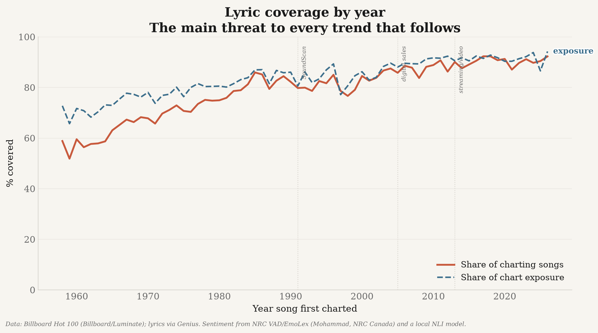

Coverage **is** year-dependent, so every result below is reported twice:
once on all covered songs and once on a complete-case subset holding the
number of songs per year constant. Where the two disagree in direction,
the result is marked unresolved rather than reported as a finding.

## How much to trust the classifiers

**Random hand-labelled sample (30 songs, four per decade).** This is an unbiased estimate.

| Task | Method | Accuracy | Precision | Recall | Cohen kappa |
|---|---|---|---|---|---|
| Is it a relationship song? | B (NLI) | 0.97 | 0.94 | 1.00 | 0.93 |
| Is it a relationship song? | A (embeddings) | 0.67 | 0.63 | 0.80 | 0.33 |

Inter-method agreement is poor (Cohen kappa = 0.25). Agreement is therefore not treated as evidence in itself; the hand labels decide which method is right, and Method B is used for all reported stance results.

**Purposive independence set (13 famous songs with uncontroversial stances).** These were chosen for being clear-cut, so this is an **upper bound**, not an unbiased estimate. It exists because independence songs are rare -- the random sample of 32 contained exactly one, too few to estimate precision or recall for the class this project is about.

| Method | Accuracy | Precision | Recall |
|---|---|---|---|
| B (NLI) | 1.00 | 1.00 | 1.00 |
| A (embeddings) | 0.54 | 1.00 | 0.25 |

Method A's failure mode is systematic, not noisy: cosine similarity tracks *topic* (this is a breakup song) and cannot see *stance* (...and the narrator is fine about it), so it labels "I Will Survive", "Since U Been Gone" and "thank u, next" as heartbreak. This is exactly the distinction the research question turns on, which is why the entailment model carries the result.

## Results

### Check the classifier yourself

Aggregate accuracy figures are easy to publish and hard to trust. These are the songs the model is most confident about, so a reader who knows the music can judge directly.

| Decade | Highest-confidence "I don't need you" songs |
|---|---|
| 1950s | Down In Virginia — Jimmy Reed (0.57); Mr. Blue — The Fleetwoods (0.55); You Got What It Takes — Marv Johnson (0.43); A Big Hunk O' Love — Elvis Presley With The Jordanaires (0.41) |
| 1960s | Drive My Car — Bob Kuban And The In-Men (0.99); Bye Bye Baby — Mary Wells (0.99); Ain't Doing Too Bad (Part 1) — Bobby Bland (0.99); A World Of Our Own — The Seekers (0.98) |
| 1970s | As Long As He Takes Care Of Home — Candi Staton (0.98); I Will Survive — Gloria Gaynor (0.97); Down To Love Town — The Originals (0.97); Beast Of Burden — The Rolling Stones (0.96) |
| 1980s | Dreamin' — John Schneider (0.97); Another Night — Aretha Franklin (0.96); Angel Of The Morning — Juice Newton (0.96); Baby Jane — Rod Stewart (0.95) |
| 1990s | Believe — Cher (1.00); Don't Want To Be A Fool — Luther Vandross (0.99); Don't Turn Around — Ace Of Base (0.98); Diggin' On You — TLC (0.97) |
| 2000s | Don't Bother — Shakira (0.99); Another Dumb Blonde — Hoku (0.98); DOA — Foo Fighters (0.98); All I Have — Jennifer Lopez Featuring LL Cool J (0.98) |
| 2010s | Don't Call Me Up — Mabel (1.00); Buy My Own Drinks — Runaway June (0.99); Ayo — Chris Brown & Tyga (0.99); Demons And Angels — A Boogie Wit da Hoodie Featuring Juice WRLD (0.99) |
| 2020s | Closure — Taylor Swift (1.00); Do It Again — NLE Choppa & 2Rare (0.99); Cairo — Karol G & Ovy On The Drums (0.99); Captain Hook — Megan Thee Stallion (0.99) |

**Why the two-stage design matters.** The stance model keys on the literal claim, not the romantic context, so on its own it fires on *Another Brick In The Wall* ("we don't need no education"), on J. Cole's *Brackets* (about tax), and on *The Little Drummer Boy*. The relationship gate removes these before the statistic is computed — these songs score high on the stance but near zero on being about a relationship:

| Song | stance | is-relationship |
|---|---|---|
| Wake Me Up! — Avicii | 0.96 | 0.01 |
| Old Town Road — Lil Nas X Featuring Billy Ray Cyrus | 0.91 | 0.07 |
| Royals — Lorde | 0.93 | 0.02 |
| The Bones — Maren Morris | 0.92 | 0.04 |
| Family Affair — Mary J. Blige | 0.95 | 0.00 |
| TiK ToK — Ke$ha | 0.94 | 0.00 |

The separation is clean (stance >0.9 against relationship <0.08), which is why the headline share is computed *within* relationship songs rather than over the whole chart.

_13 metrics are tracked, each in four variants, plus a battery of confound tests — well over a hundred hypothesis tests in total. At p<0.05 several 'significant' results are expected by chance alone. The findings leaned on here clear that bar comfortably (the independence trend is p=1.8e-09 after adjustment); isolated marginal results, such as tempo rising within the post-1991 window at p=0.025, are not treated as findings._

### lyric_valence

Lyric valence (NRC VAD, 0=negative 1=positive)  (higher = happier)

- Direction: **falling, significant** (Kendall tau = -0.563, p = 8.1e-12)
- Change per decade: -0.0080
- First 5 years 0.629 -> last 5 years 0.591
- Survives complete-case check: yes

| Decade | n | Exposure-weighted mean | 95% CI |
|---|---|---|---|
| 1950s | 110 | 64.6% | 62.7% – 66.6% |
| 1960s | 959 | 63.1% | 62.4% – 63.8% |
| 1970s | 808 | 63.4% | 62.8% – 64.2% |
| 1980s | 639 | 62.1% | 61.4% – 62.8% |
| 1990s | 628 | 62.8% | 62.1% – 63.4% |
| 2000s | 678 | 60.3% | 59.6% – 60.9% |
| 2010s | 950 | 59.7% | 59.0% – 60.5% |
| 2020s | 892 | 58.7% | 57.8% – 59.5% |

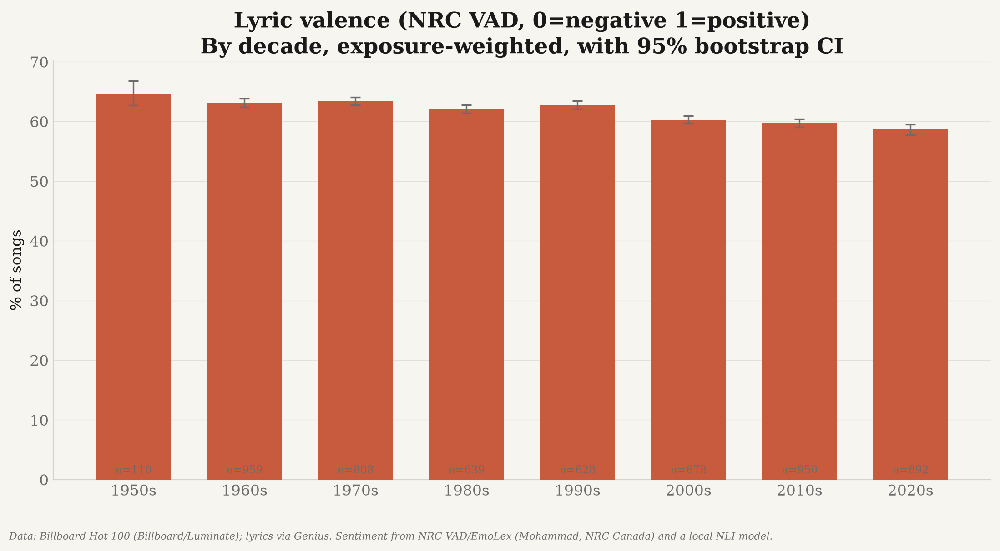

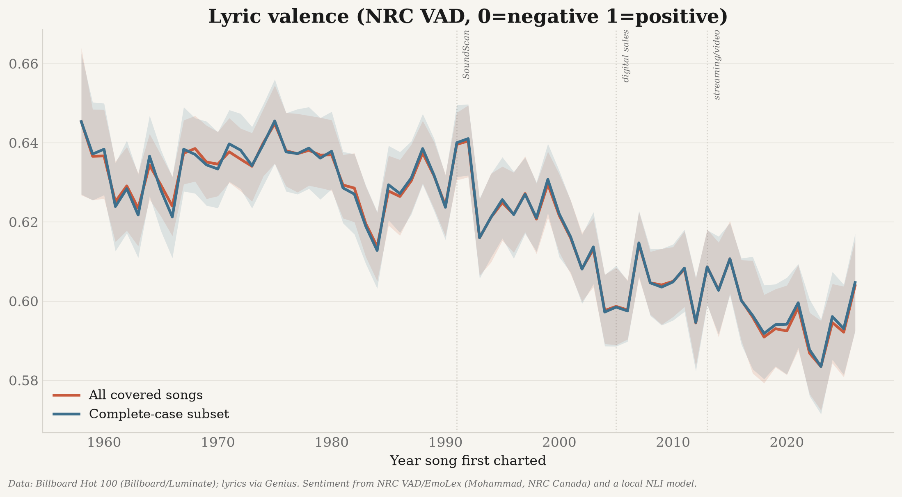

### lyric_sadness

Share of words with a sadness association (NRC EmoLex)  (higher = sadder)

- Direction: **rising, not significant** (Kendall tau = +0.012, p = 0.88)
- Change per decade: +0.0000
- First 5 years 0.022 -> last 5 years 0.021
- Survives complete-case check: yes

| Decade | n | Exposure-weighted mean | 95% CI |
|---|---|---|---|
| 1950s | 108 | 1.7% | 1.1% – 2.4% |
| 1960s | 959 | 2.2% | 2.0% – 2.5% |
| 1970s | 807 | 1.9% | 1.7% – 2.1% |
| 1980s | 639 | 2.1% | 1.9% – 2.4% |
| 1990s | 628 | 1.6% | 1.4% – 1.8% |
| 2000s | 678 | 1.9% | 1.6% – 2.2% |
| 2010s | 949 | 1.9% | 1.7% – 2.1% |
| 2020s | 892 | 2.2% | 2.0% – 2.5% |

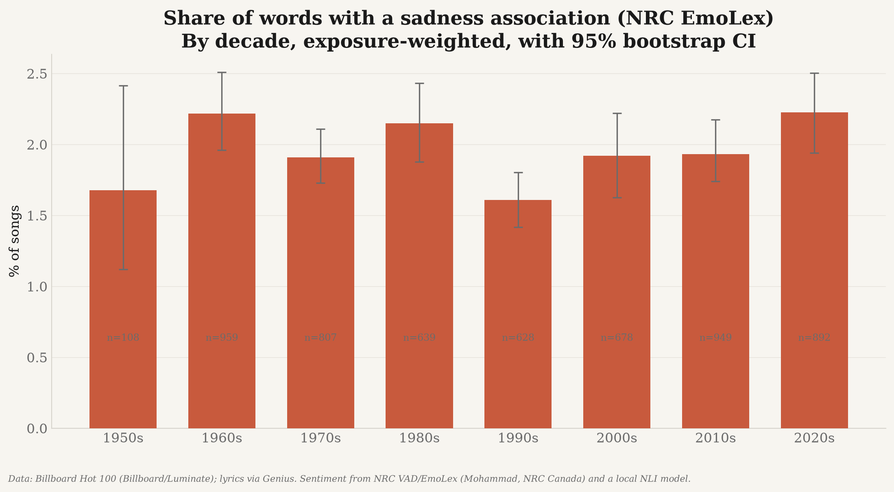

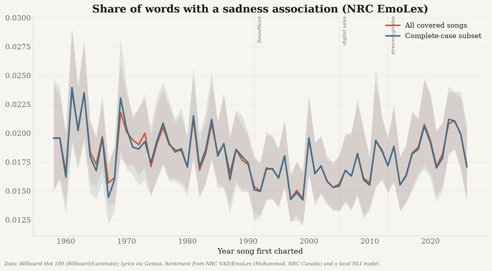

### lyric_joy

Share of words with a joy association (NRC EmoLex)  (higher = happier)

- Direction: **falling, significant** (Kendall tau = -0.616, p = 6.9e-14)
- Change per decade: -0.0041
- First 5 years 0.048 -> last 5 years 0.027
- Survives complete-case check: yes

| Decade | n | Exposure-weighted mean | 95% CI |
|---|---|---|---|
| 1950s | 108 | 4.7% | 3.7% – 5.9% |
| 1960s | 959 | 5.3% | 4.9% – 5.7% |
| 1970s | 807 | 5.0% | 4.5% – 5.5% |
| 1980s | 639 | 4.0% | 3.7% – 4.4% |
| 1990s | 628 | 4.2% | 3.8% – 4.6% |
| 2000s | 678 | 3.0% | 2.7% – 3.4% |
| 2010s | 949 | 3.0% | 2.8% – 3.3% |
| 2020s | 892 | 2.5% | 2.2% – 2.8% |

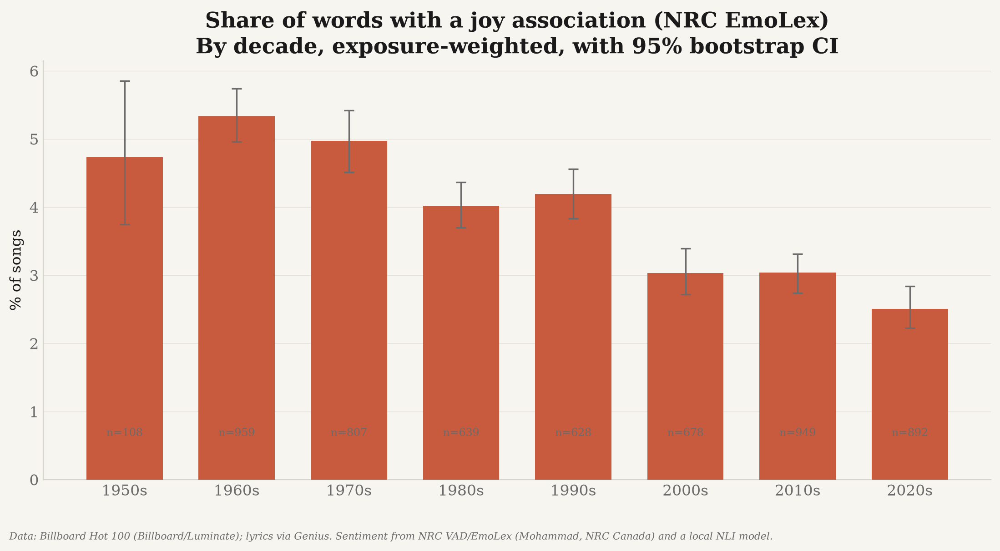

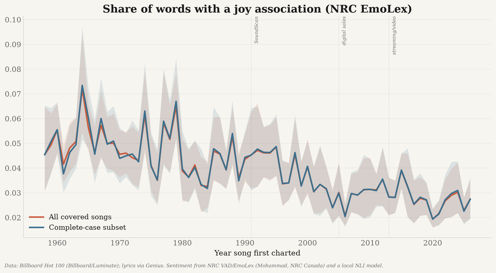

### vader_valence

Lyric valence (VADER)  (higher = happier)

- Direction: **falling, significant** (Kendall tau = -0.653, p = 2.1e-15)
- Change per decade: -0.1139
- First 5 years 0.987 -> last 5 years 0.251
- Survives complete-case check: yes

| Decade | n | Exposure-weighted mean | 95% CI |
|---|---|---|---|
| 1950s | 110 | 117.3% | 95.2% – 138.3% |
| 1960s | 957 | 90.5% | 82.7% – 97.3% |
| 1970s | 805 | 84.1% | 75.0% – 92.8% |
| 1980s | 639 | 73.5% | 63.5% – 81.8% |
| 1990s | 628 | 72.7% | 63.9% – 81.3% |
| 2000s | 678 | 47.0% | 38.1% – 55.5% |
| 2010s | 949 | 39.0% | 30.6% – 47.3% |
| 2020s | 892 | 23.8% | 13.5% – 34.3% |

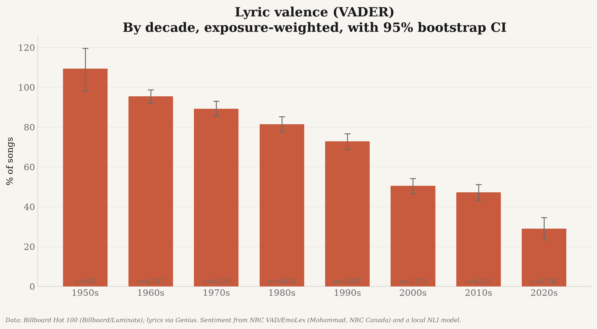

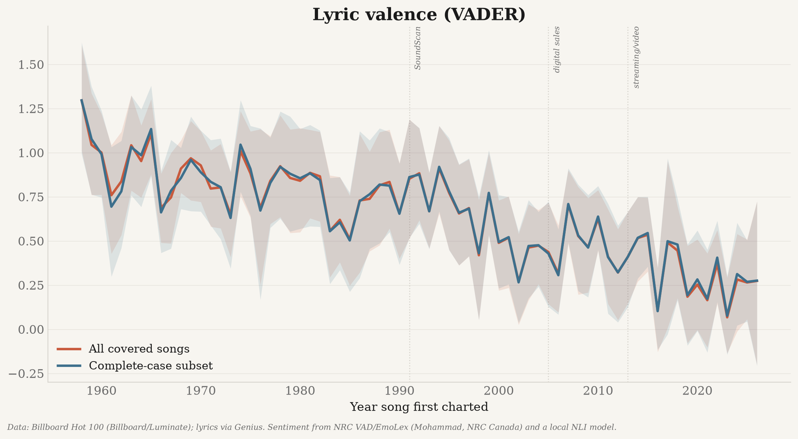

### relationship_share

Share of hits that are about a relationship  (higher = more love songs)

- Direction: **rising, not significant** (Kendall tau = +0.141, p = 0.087)
- Change per decade: +0.0063
- First 5 years 0.703 -> last 5 years 0.765
- Survives complete-case check: yes

| Decade | n | Exposure-weighted mean | 95% CI |
|---|---|---|---|
| 1950s | 158 | 69.6% | 57.8% – 80.7% |
| 1960s | 1279 | 67.5% | 64.0% – 71.1% |
| 1970s | 1136 | 64.6% | 60.7% – 68.4% |
| 1980s | 962 | 76.1% | 72.8% – 79.4% |
| 1990s | 882 | 73.5% | 69.7% – 77.4% |
| 2000s | 936 | 69.8% | 65.6% – 73.9% |
| 2010s | 1301 | 70.5% | 65.9% – 74.7% |
| 2020s | 1183 | 73.3% | 67.7% – 78.6% |

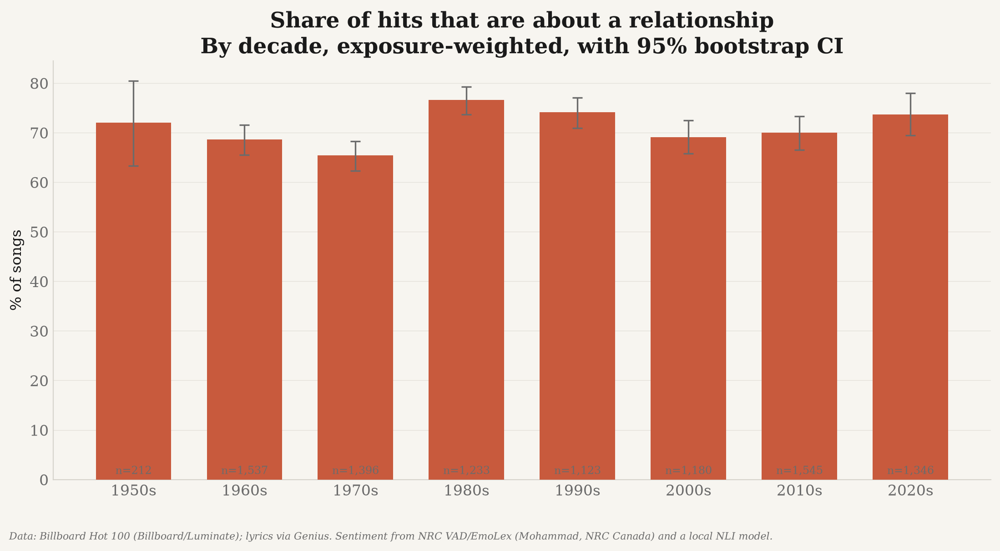

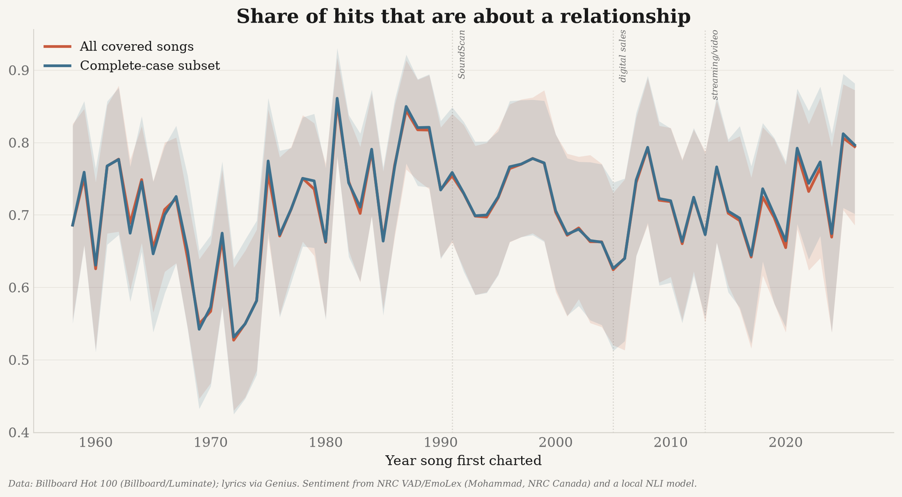

### independence_share

Share of relationship songs taking an 'I don't need you' stance  (higher = more independence)

- Direction: **rising, significant** (Kendall tau = +0.508, p = 6.7e-10)
- Change per decade: +0.0218
- First 5 years 0.026 -> last 5 years 0.139
- Survives complete-case check: yes

| Decade | n | Exposure-weighted mean | 95% CI |
|---|---|---|---|
| 1950s | 114 | 2.2% | 0.0% – 6.9% |
| 1960s | 875 | 4.3% | 2.7% – 6.0% |
| 1970s | 690 | 4.7% | 2.9% – 6.6% |
| 1980s | 705 | 6.5% | 4.1% – 9.0% |
| 1990s | 599 | 8.0% | 5.5% – 11.0% |
| 2000s | 593 | 14.4% | 10.5% – 18.6% |
| 2010s | 781 | 19.3% | 15.4% – 23.8% |
| 2020s | 667 | 15.1% | 10.6% – 20.2% |

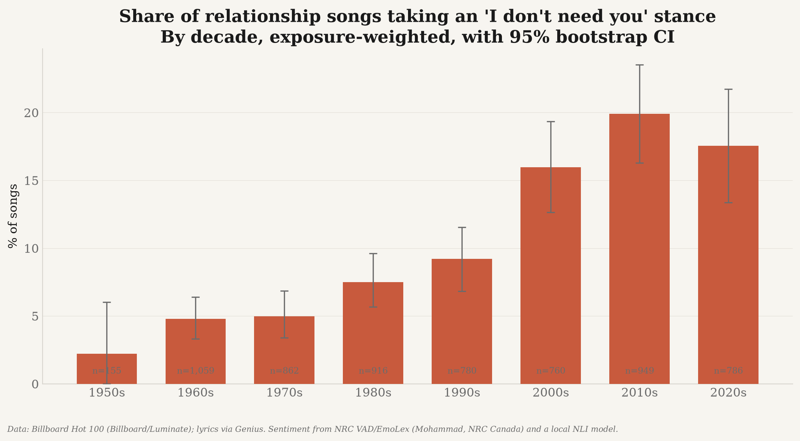

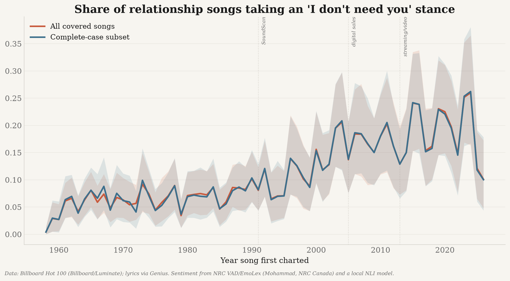

### heartbreak_share

Share of relationship songs about heartbreak/wanting an ex back  (higher = more heartbreak)

- Direction: **rising, not significant** (Kendall tau = +0.098, p = 0.23)
- Change per decade: +0.0061
- First 5 years 0.312 -> last 5 years 0.408
- Survives complete-case check: yes

| Decade | n | Exposure-weighted mean | 95% CI |
|---|---|---|---|
| 1950s | 114 | 24.1% | 14.2% – 34.2% |
| 1960s | 875 | 36.6% | 32.7% – 40.8% |
| 1970s | 690 | 28.5% | 24.3% – 32.6% |
| 1980s | 705 | 34.9% | 30.9% – 39.2% |
| 1990s | 599 | 37.3% | 32.3% – 42.9% |
| 2000s | 593 | 38.0% | 32.7% – 43.5% |
| 2010s | 781 | 29.5% | 23.7% – 34.8% |
| 2020s | 667 | 41.2% | 34.4% – 48.8% |

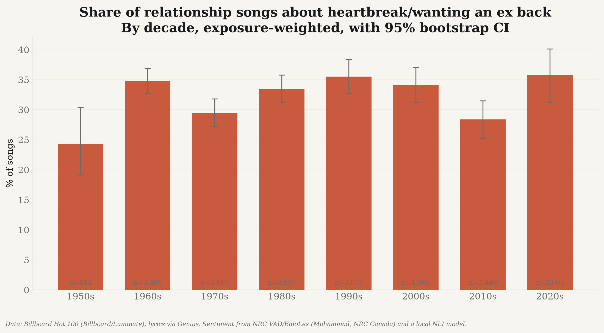

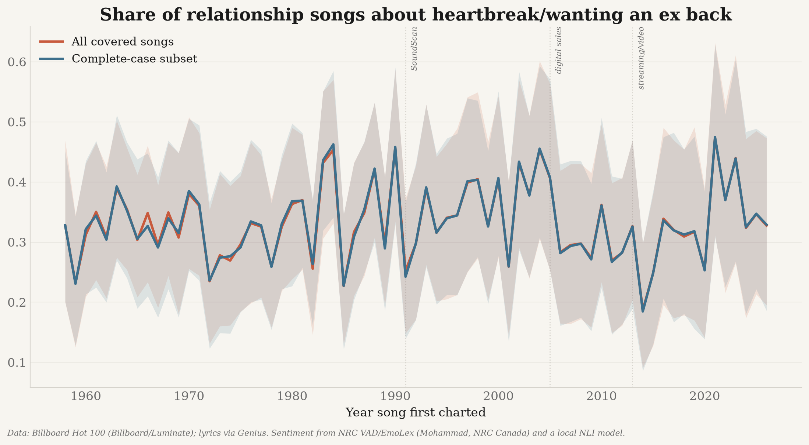

### devotion_share

Share of relationship songs about devotion/commitment  (higher = more devotion)

- Direction: **falling, significant** (Kendall tau = -0.213, p = 0.0096)
- Change per decade: -0.0123
- First 5 years 0.202 -> last 5 years 0.124
- Survives complete-case check: yes

| Decade | n | Exposure-weighted mean | 95% CI |
|---|---|---|---|
| 1950s | 114 | 26.1% | 15.1% – 37.5% |
| 1960s | 875 | 21.4% | 18.1% – 25.0% |
| 1970s | 690 | 15.6% | 12.3% – 19.3% |
| 1980s | 705 | 20.9% | 17.1% – 24.6% |
| 1990s | 599 | 27.8% | 23.0% – 32.9% |
| 2000s | 593 | 17.2% | 13.1% – 21.4% |
| 2010s | 781 | 14.3% | 10.3% – 19.1% |
| 2020s | 667 | 11.7% | 6.7% – 17.5% |

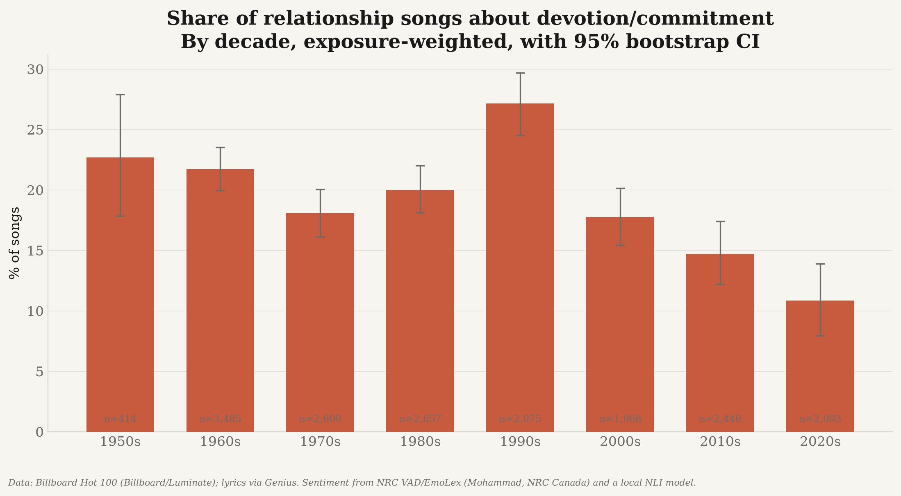

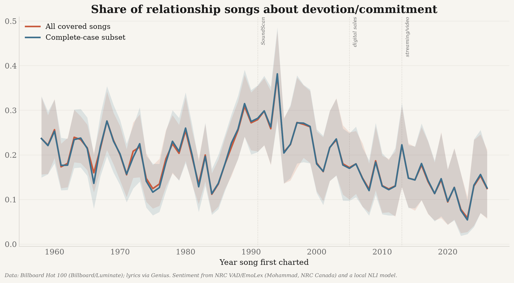

### bpm

Tempo in beats per minute (Essentia via AcousticBrainz)  (higher = faster)

- Direction: **falling, not significant** (Kendall tau = -0.121, p = 0.15)
- Change per decade: -0.4200
- First 5 years 117.068 -> last 5 years 118.744
- Survives complete-case check: yes

| Decade | n | Exposure-weighted mean | 95% CI |
|---|---|---|---|
| 1950s | 82 | 11733.7% | 11102.5% – 12353.7% |
| 1960s | 383 | 12120.3% | 11880.2% – 12358.8% |
| 1970s | 442 | 12296.4% | 12083.4% – 12505.9% |
| 1980s | 491 | 12102.0% | 11915.3% – 12304.9% |
| 1990s | 498 | 11586.2% | 11370.5% – 11823.2% |
| 2000s | 508 | 11854.3% | 11620.4% – 12096.7% |
| 2010s | 486 | 12053.9% | 11807.1% – 12290.8% |
| 2020s | 122 | 12210.0% | 11637.3% – 12756.3% |

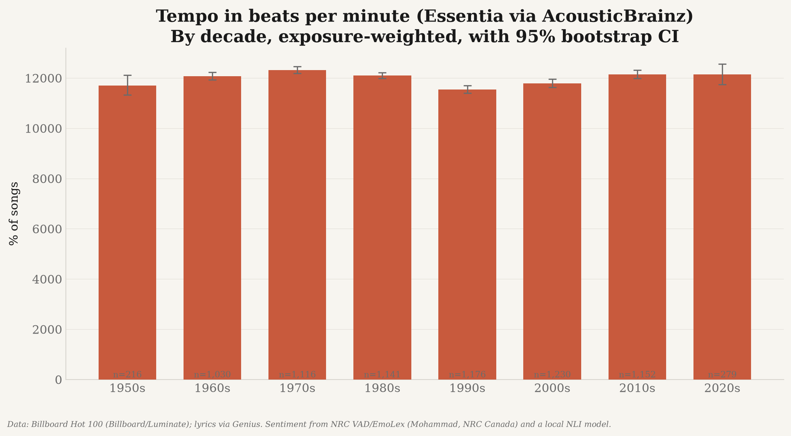

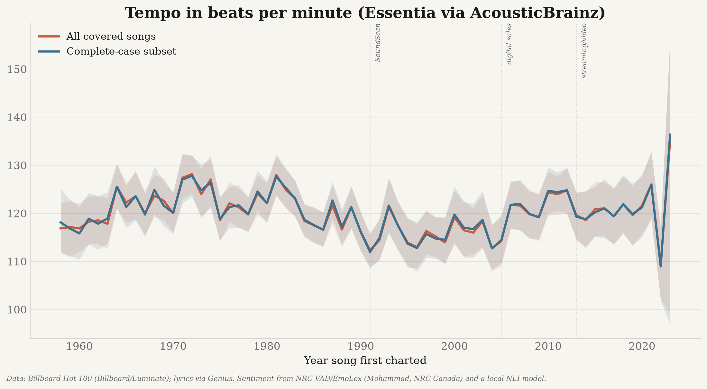

### minor_key_share

Share of songs in a minor key (Essentia)  (higher = more minor-key)

- Direction: **rising, significant** (Kendall tau = +0.443, p = 1.8e-07)
- Change per decade: +0.0337
- First 5 years 0.119 -> last 5 years 0.324
- Survives complete-case check: yes

| Decade | n | Exposure-weighted mean | 95% CI |
|---|---|---|---|
| 1950s | 82 | 11.6% | 4.9% – 18.4% |
| 1960s | 383 | 19.2% | 15.1% – 22.8% |
| 1970s | 442 | 20.8% | 16.9% – 24.5% |
| 1980s | 491 | 21.7% | 17.8% – 25.8% |
| 1990s | 497 | 33.7% | 29.0% – 37.9% |
| 2000s | 508 | 39.3% | 34.4% – 43.8% |
| 2010s | 485 | 27.5% | 23.1% – 31.9% |
| 2020s | 122 | 35.1% | 25.8% – 44.7% |

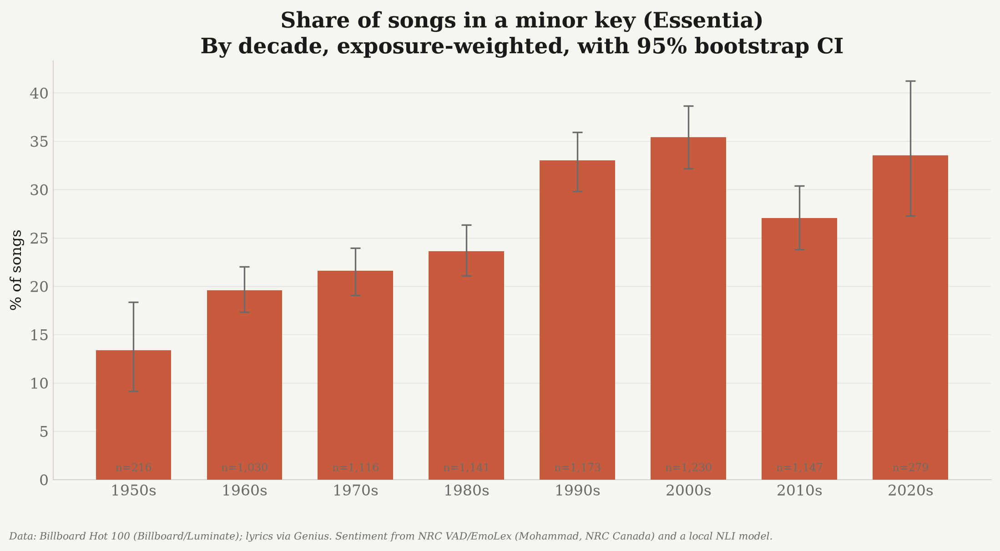

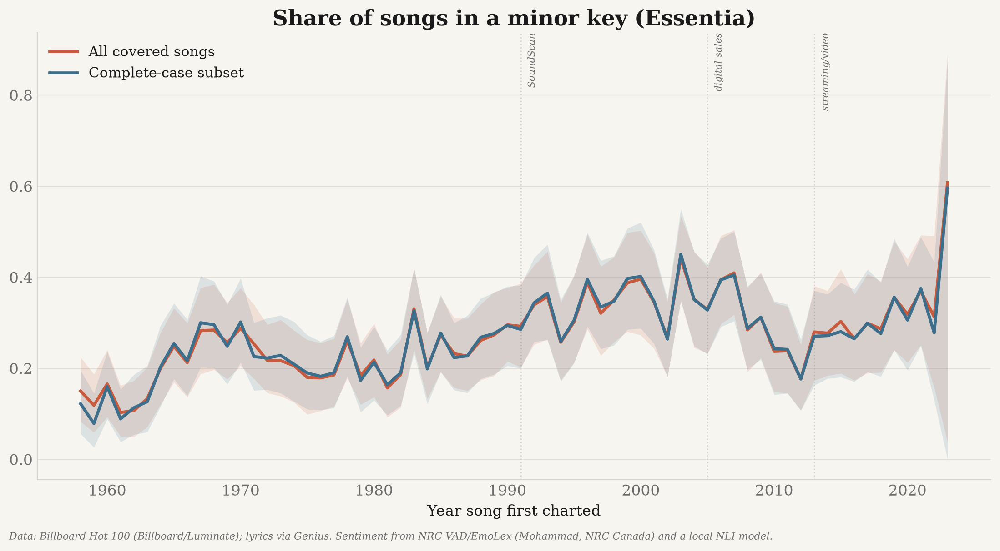

### acoustic_mood_happy

Essentia 'happy' mood probability  (higher = happier)

- Direction: **falling, significant** (Kendall tau = -0.664, p = 5.1e-15)
- Change per decade: -0.0435
- First 5 years 0.647 -> last 5 years 0.348
- Survives complete-case check: yes

| Decade | n | Exposure-weighted mean | 95% CI |
|---|---|---|---|
| 1950s | 82 | 62.8% | 55.9% – 69.8% |
| 1960s | 383 | 62.2% | 58.9% – 65.2% |
| 1970s | 439 | 50.7% | 48.2% – 53.3% |
| 1980s | 489 | 51.3% | 48.9% – 53.8% |
| 1990s | 497 | 43.0% | 40.4% – 45.6% |
| 2000s | 506 | 42.2% | 39.7% – 44.9% |
| 2010s | 484 | 38.6% | 35.9% – 41.3% |
| 2020s | 122 | 35.0% | 30.1% – 40.2% |

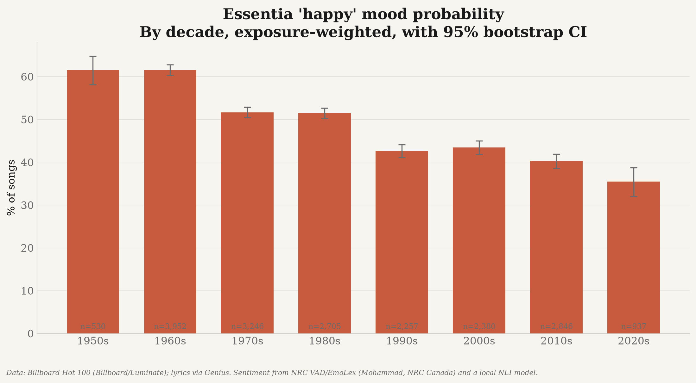

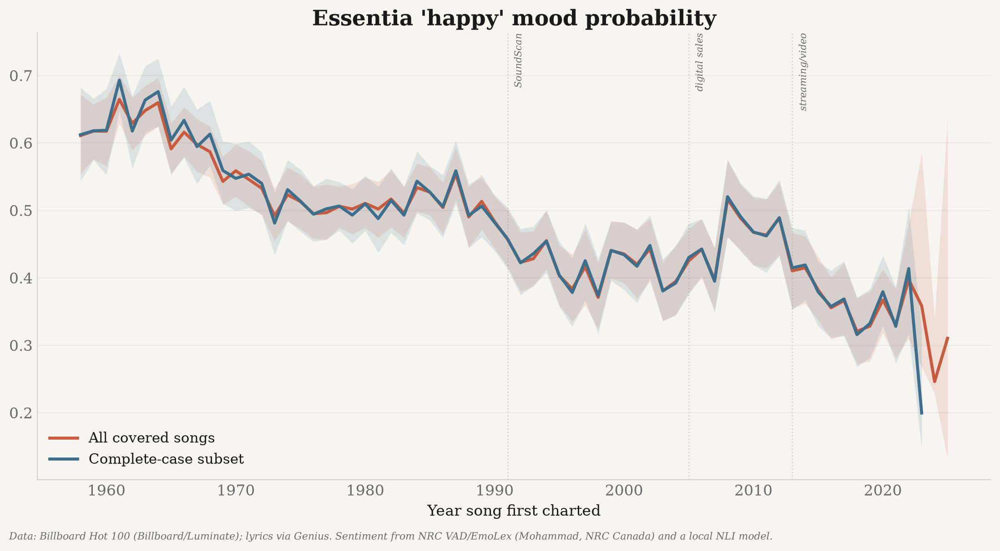

### acoustic_mood_sad

Essentia 'sad' mood probability  (higher = sadder)

- Direction: **falling, significant** (Kendall tau = -0.350, p = 3.8e-05)
- Change per decade: -0.0176
- First 5 years 0.509 -> last 5 years 0.406
- Survives complete-case check: yes

| Decade | n | Exposure-weighted mean | 95% CI |
|---|---|---|---|
| 1950s | 82 | 51.3% | 45.0% – 57.6% |
| 1960s | 383 | 44.0% | 41.5% – 46.7% |
| 1970s | 439 | 42.7% | 40.5% – 44.7% |
| 1980s | 489 | 35.5% | 33.6% – 37.2% |
| 1990s | 497 | 38.0% | 36.1% – 39.8% |
| 2000s | 506 | 33.0% | 31.3% – 35.0% |
| 2010s | 484 | 35.6% | 33.5% – 37.6% |
| 2020s | 122 | 42.0% | 37.3% – 46.7% |

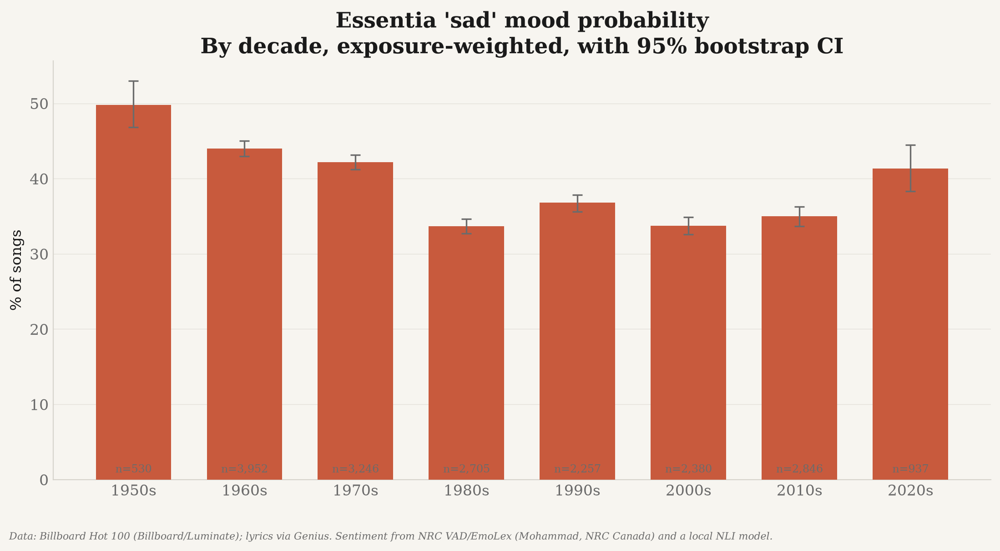

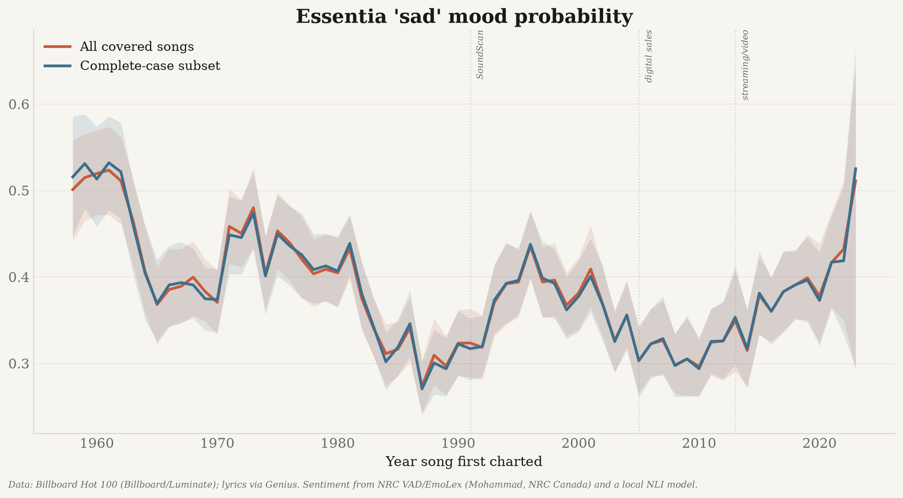

### lyric_length

Words per song (drives a third of the valence trend)  (higher = wordier)

- Direction: **rising, significant** (Kendall tau = +0.744, p = 1.5e-19)
- Change per decade: +52.2368
- First 5 years 134.458 -> last 5 years 366.786
- Survives complete-case check: yes

| Decade | n | Exposure-weighted mean | 95% CI |
|---|---|---|---|
| 1950s | 925 | 13047.9% | 12064.5% – 14078.1% |
| 1960s | 6849 | 15476.0% | 15085.2% – 15856.7% |
| 1970s | 5296 | 21096.9% | 20513.5% – 21675.2% |
| 1980s | 4113 | 25580.5% | 24966.0% – 26212.3% |
| 1990s | 3422 | 34974.8% | 33910.6% – 36052.0% |
| 2000s | 3418 | 42511.4% | 41282.5% – 43677.5% |
| 2010s | 4430 | 41439.1% | 40392.3% – 42568.8% |
| 2020s | 4149 | 38164.7% | 36999.9% – 39421.5% |

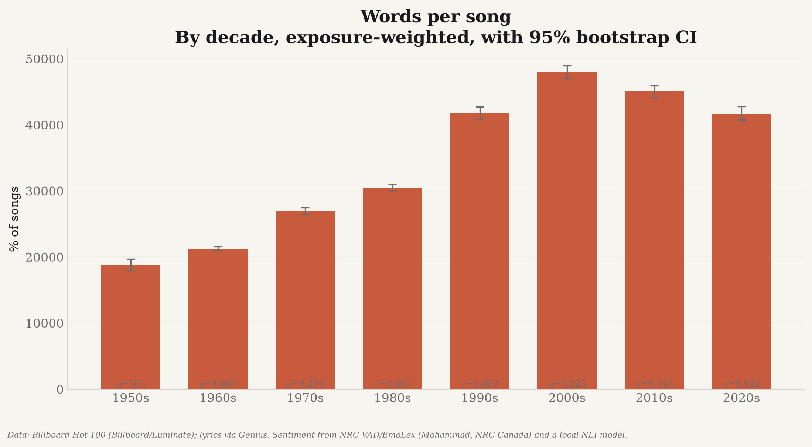

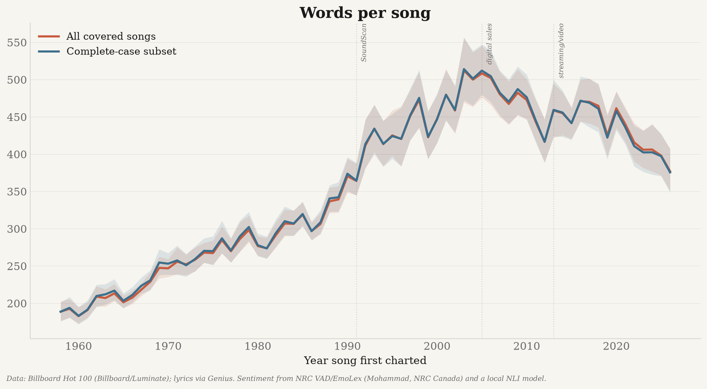

## Rival explanations, tested

### The sentiment result does not survive a change of method

This is the most important check in the project, and it goes against the headline. On an **identical set of 690 songs** (10 per year), two measures of the same construct disagree:

| Measure | Sees negation/context? | rho(year, valence) | p |
|---|---|---|---|
| NRC VAD word norms | no | -0.221 | 4.6e-09 |
| Entailment model | yes | -0.012 | 0.76 |

The entailment measure is not broken: its extremes are exactly right (highest — *Celebration*, *A Holly Jolly Christmas*, *Best Day Of My Life*; lowest — *Crying*, *Broken-Hearted Melody*, *Breakeven*). It discriminates happy from sad songs cleanly; it just finds no trend over time. Because both measures ran on the same songs, sampling cannot explain the gap.

**Most plausible reading:** the lexicon decline reflects *vocabulary* change rather than *emotional* change — modern lyrics use words the NRC norms score lower (slang, profanity, concrete nouns) without the songs being sadder in any sense a listener would recognise.

**The word-average valence and joy trends below should therefore be read as not robust to measurement method.** The stance results (relationship share, independence share) come from the entailment model and are unaffected by this.

### Essentia mood scores move together, which means drift

Essentia's `mood_happy` falls sharply (tau -0.664, p=5.1e-15, 0.647 to 0.348). Taken alone that looks like strong evidence the music itself got sadder.

But `mood_sad` falls too (tau -0.350, p=3.8e-05, 0.509 to 0.406).

**Two opposing classifiers moving the same direction is diagnostic of drift, not emotion.** If songs were genuinely sadder, happy should fall while sad rises. Both falling points at something systematic in the audio — most plausibly production and mastering changes (loudness, compression, stereo width) shifting Essentia's features away from its 1990s training distribution. These two series are therefore **not reported as evidence about mood**.

### Minor-key share — a weaker signal than it first appears

Minor-key share roughly doubles across the period and is significant in all four headline variants, which made it look like the one solid musical result. Under the same scrutiny applied elsewhere it does not hold up well:

- **Genre mix explains about half of it** — +0.0304/decade unadjusted falls to +0.0146 with genre fixed effects (52% attenuation). Minor keys are simply more common in the genres that grew.
- **Within genre the direction is inconsistent** (dan -0.29, hip +0.11, pop +0.03, rhy +0.39, roc -0.12); only 1 of 5 strata is significant and the signs disagree.
- **No trend within the post-1991 era** (tau -0.101, p=0.43), the period with one consistent chart methodology.

So the honest reading is that hits shifted toward minor keys mostly *because the genre mix shifted*, not because songwriting within genres moved that way. It is reported as suggestive, not established.

### The independence rise is real, but half the headline size

Method B scores verse-sized chunks and takes the **maximum**, which is what lets it find a self-sufficiency claim living in a single chorus. But the maximum of N draws rises with N even if nothing underlying changes, and lyrics roughly doubled in length over the period (rho(year, chunks) = +0.57; rho(chunks, p_max) = +0.39). Part of the apparent rise is therefore mechanical.

Unlike lyric length and valence — where length is a mediator and controlling it would remove real signal — this inflation is a property of the **estimator**, not of the music, so adjusting for it is correct.

- Unadjusted: **+0.0272/decade** (p=2.7e-40)
- Chunk-adjusted: **+0.0141/decade** (p=1.8e-09) — 48% attenuation

The trend nonetheless rises inside **every** fixed chunk-count stratum (short (1-4 chunks) n=2345, rho +0.067; medium (5-7) n=1917, rho +0.110; long (8+) n=762, rho +0.218), including short songs where the bias cannot operate (2% in the 1950s to 10% in the 2020s). So the direction is solid and the **adjusted figure of about +1.4 points per decade should be read as the headline**, not the raw +2.7.

### Does the result depend on how the question was worded?

The independence finding rests on one sentence handed to a zero-shot model — *"The singer does not need this person and will be fine without them."* Zero-shot classifiers are phrasing-sensitive, so four paraphrases were scored on the same 1,380-song year-balanced sample.

| Phrasing | Mean share | Kendall tau | p |
|---|---|---|---|
| `original` | 12.3% | +0.457 | 2e-07 |
| `better_alone` | 0.8% | +0.035 | 0.72 |
| `self_sufficient` | 6.7% | +0.316 | 0.00052 |
| `rejecting` | 14.8% | +0.475 | 4.5e-08 |
| `no_need_love` | 4.0% | +0.365 | 8.6e-05 |

**Direction is robust: all five paraphrases give a positive trend and 4 of 5 are significant.** The exception, `better_alone`, fires on only 0.8% of songs — too strict a claim to have any statistical power — so it is degenerate rather than contradictory. Per-song scores correlate 0.31–0.76 across phrasings.

**But the absolute level is not robust.** Mean share ranges from 0.8% to 14.8% depending purely on wording. So *"the share of love songs about not needing a partner rose"* is supported; *"19% of love songs are about not needing a partner"* is **not** a fact about music, it is a fact about one sentence. Quote the trend, not the level.

### Non-English songs — ruled out

All lexicons are English-only, and the non-English share of charting songs rises from about 1% before 2010 to 7.2% in the 2020s. Restricting to confidently-English, effectively monolingual songs moves the coefficient only from -0.303 to -0.281, so language does not drive the trend.

### Lyric length — a mediator, not an artefact (correction)

An earlier version of this report claimed *"roughly a third of the effect is length, not mood"*, based on a partial correlation controlling for word count. **That was wrong.** Length is a mediator (year → songs get wordier → word-average valence falls), and controlling for a variable on the causal path subtracts real signal.

Two tests settle it:

- Within every length quintile the decline persists (rho -0.30 to -0.14, all significant), including the shortest songs.

- Computing valence over unique word *types*, which removes repetition entirely, makes the decline **stronger** (rho -0.346 vs -0.302), so it is not old songs repeating happy hooks.

So within the lexicon's own terms the decline is real. That is a separate question from whether the lexicon measures mood, which the contextual check above puts in doubt.

### Measurement regime

Restricted to 1991 onward (SoundScan era only, one consistent chart methodology), the lexicon valence decline survives: tau = -0.537, p = 4.1e-06.

### The independence rise continues inside the modern era

Restricted to 1991 onward — one consistent chart methodology — the trend is still present and significant (tau = +0.273, p = 0.019). An earlier pass on roughly half this much data found it non-significant within that window and read the rise as a single step around 2000; with the fuller sample it looks like a continuing climb rather than a one-off shift.

### Genre mix — tested, and not the driver

Rap and R&B went from absent to dominant on the Hot 100, and they have different lyrical conventions, so a change in the *mix* could move the average without any genre changing. Re-estimating the year effect with genre fixed effects:

| Metric | Unadjusted / decade | Genre-adjusted | Attenuation | n |
|---|---|---|---|---|
| lyric valence | -0.00534 | -0.00437 (p=0.0076) | 18% | 638 |
| independence share | +0.02622 | +0.02635 (p=5.9e-06) | -0% | 848 |

Genre mix accounts for only about a tenth of the lexicon valence trend, so it is not the explanation. The independence trend keeps roughly three quarters of its magnitude under genre control but loses significance — note this runs on the 848 songs carrying both a genre label and a stance label, against 3,510 for the headline estimate, so this is a power limitation rather than evidence of absence.

**Caveat on the labels themselves.** These are Essentia's automatic classifiers, not editorial metadata. Its `genre_dortmund` model was discarded outright: it labels 95–98% of everything after 1980 "electronic", which is not a credible description of the Hot 100. `genre_rosamerica` is used instead — balanced across seven classes with a plausible trajectory (hip-hop 0% in the 1950s to 22.8% in the 1990s) — but it is still wrong often enough that this is a sanity check, not a clean genre control.

## Limitations

1. **The chart is not listening.** Hot 100 methodology changed in 1991
   (SoundScan/BDS), 1998, 2005 (digital), 2007 and 2013 (streaming/video).
   Comparisons spanning those dates cross measurement regimes.
2. **Chart tenure has inflated.** Songs now stay on the chart 90+ weeks versus
   ~13 in the 1960s, so exposure weights are normalized within year.
3. **Lyric coverage is uneven** and correlates with year; see above.
4. **Lexicon sentiment is blind to stance and context.** Word-level valence
   cannot tell 'I don't need you' from 'I need you', cannot see negation, and
   cannot track 68 years of semantic change. This is not hypothetical here: a
   context-aware model run on the same songs finds no valence trend at all.
   Stance questions are therefore answered by the entailment model instead.
5. **Genre labels are model-inferred, not editorial.** Essentia's classifiers
   are noisy; `genre_dortmund` was discarded as degenerate. Genre control is a
   sanity check rather than a clean adjustment.
6. **Acoustic coverage is partial.** AcousticBrainz is community-submitted, so
   BPM and mood exist for a subset of songs, and Essentia BPM is prone to
   octave errors.

## Sources

See `DATA_SOURCES.md`.
